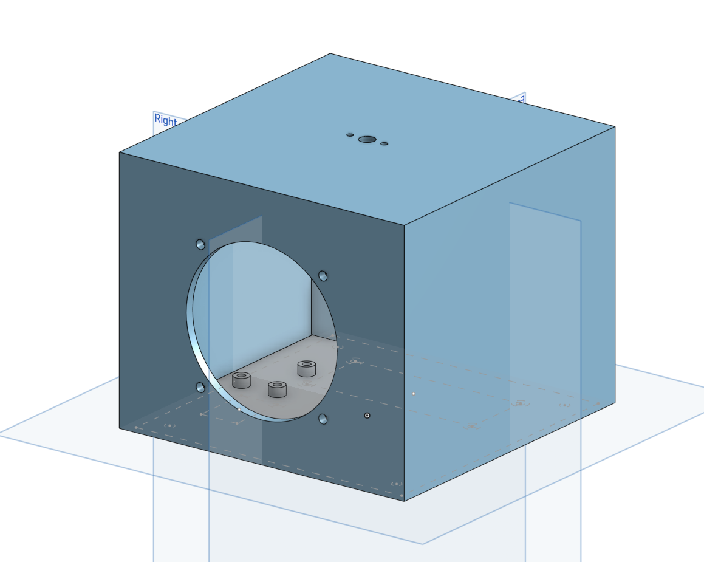

# My Awesome Assistant

This is my super cool smart speaker and assistant. You can talk with the assistant by using wake word "Alexa" and it will answer back!

The case is super simple, I don't need any extra components since I just wanted to give a basic introduction into Onshape! (You put here what makes your speaker special!)

Here's the screen recording (with audio) of my assistant: [./demo.webm](demo.webm)

Here's the link to my onshape model: <https://cad.onshape.com/documents/55db4cfc1e30219ea9eddda8/w/44bd6c9fec3d834e2e2c1732/e/7c44ba390dc78aad5aae2d44?renderMode=0&uiState=6819f7ddc4b7da7a6bb72048>

My Slack username: @Jannik

## Bom

I don't need any extra parts for the $15 grant, but if I would I would put them into a table like this one:

**Fasteners:**

| Name | Price | Link |
|------|-------|------|
| 30x M2.5x3x3.5mm Heat insert | $1.83 | [Aliexpress](https://de.aliexpress.com/item/1005003582355741.html) |
| 14x M2.5x6mm Hex socket screw (for feet) | $1.41 | [Aliexpress](https://de.aliexpress.com/item/32810872544.html)|
| 16x M2.5x8mm Hex socket screw (for mounting frame) | $1.64 | [Aliexpress](https://de.aliexpress.com/item/32810872544.html) |
| 9x M3x10mm Hex socket screw | $1.79 | [Aliexpress](https://de.aliexpress.com/item/32810872544.html) |

Total: $6,67

**Electronics:**

|Name|Price|Link|
| ----- | ---- | ---- |
| SK6812 MINI-E | $2.85 for 100 | [Aliexpress](https://de.aliexpress.com/item/1005002782417198.html) |
| Gateron Low-profile hot-swap socket | $9.03 for 100 => $0.1 per socket | [Aliexpress](https://de.aliexpress.com/item/1005008078611488.html?spm=a2g0o.productlist.main.1.3d3470f0o9Li2s&algo_pvid=ef243bac-f923-4f5b-85e0-b6818cdc378c&pdp_ext_f=%7B%22order%22%3A%2223%22%2C%22eval%22%3A%221%22%7D&utparam-url=scene%3Asearch%7Cquery_from%3A) |
| Rotary-encoder | in stock | - |

Total: $8.88

**TOTAL: $14,85**
